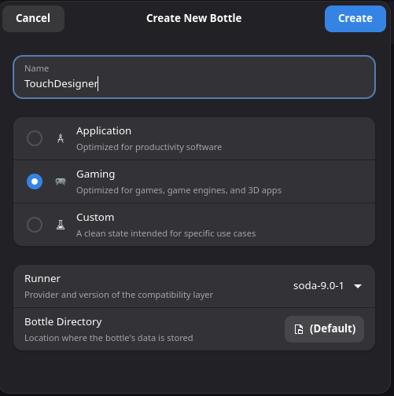
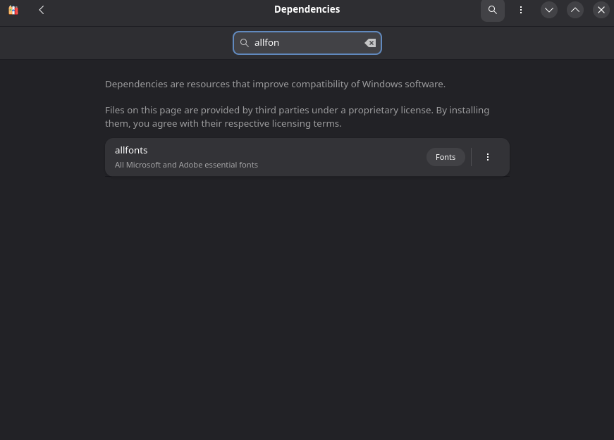
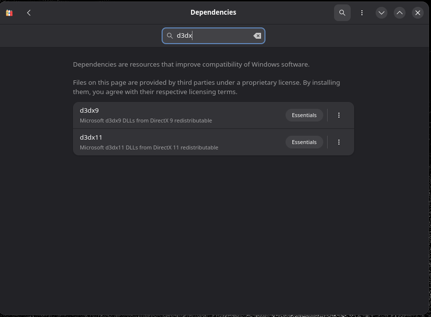
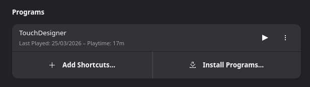
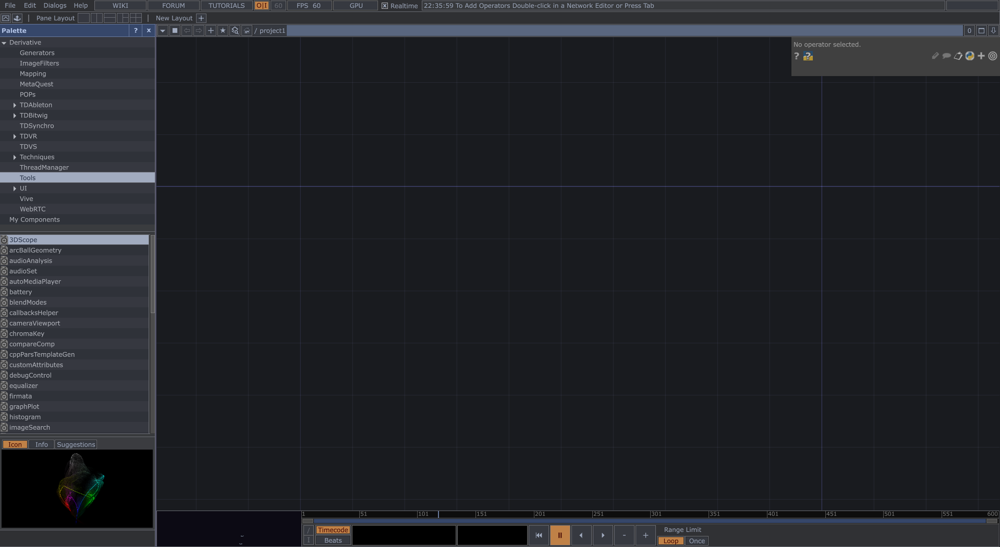
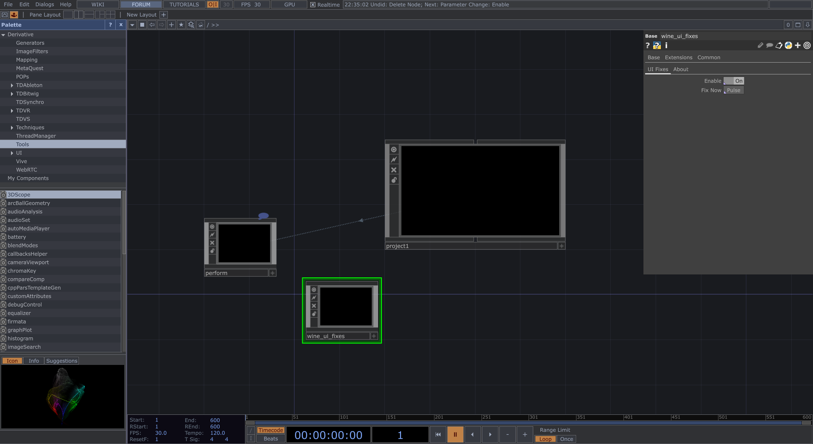

# TouchDesigner on Linux (via Bottles)

TouchDesigner is not officially supported on Linux, but it can run very well through Bottles (on Wayland).

This guide gives a complete, working setup.

## Table of Contents

- [1. Install Bottles](#1-install-bottles)
- [2. Create the TouchDesigner Bottle](#2-create-the-touchdesigner-bottle)
- [3. Install Dependencies](#3-install-dependencies)
- [4. Install TouchDesigner](#4-install-touchdesigner)
- [5. Launch TouchDesigner](#5-launch-touchdesigner)
- [6. Fix Missing Fonts](#6-fix-missing-fonts)
- [7. Optional: Flatpak Filesystem Access](#7-optional-flatpak-filesystem-access)
- [8. Optional: Desktop Integration](#8-optional-desktop-integration)
- [9. Screenshots](#9-screenshots)
- [10. Notes](#10-notes)

---

## 1. Install Bottles

Install Bottles using one of the methods below.

### Flatpak (recommended on Fedora, Mint, and similar distros)

```bash
flatpak install flathub com.usebottles.bottles
```

If Bottles does not appear in your app menu, restart your session.

### AUR (Arch-based distros)

```bash
yay -S bottles
```

---

## 2. Create the TouchDesigner Bottle

1. Open Bottles.
2. Create a new bottle.
3. Use these settings:

| Setting | Value |
| --- | --- |
| Name | TouchDesigner |
| Environment | Gaming |
| Runner | soda |
| Directory | Default |

4. Create the bottle and wait for setup to finish.

---

## 3. Install Dependencies

Inside the bottle:

1. Go to **Dependencies**.
2. Install:
	- `allfonts`
	- `d3dx11` (latest version)

---

## 4. Install TouchDesigner

1. Download the Windows installer from Derivative.
2. In Bottles, click **Run Executable**.
3. Select the `.exe` file.
4. Install normally (same process as Windows).

---

## 5. Launch TouchDesigner

1. Open **Programs** in Bottles.
2. Click **Play** on TouchDesigner.

TouchDesigner should now run.

---

## 6. Fix Missing Fonts

Some UI elements may appear blank due to font rendering issues.

### Solution

1. Add `wine_ui_fixes.tox` to your project.
	- [Download `wine_ui_fixes.tox` directly](https://raw.githubusercontent.com/isw3d/TouchDesigner-Linux/main/wine_ui_fixes.tox)
	- Original post: [c0deous on Derivative](https://derivative.ca/community-post/asset/minor-ui-fixes-touchdesigner-wine/73421)
2. Click **Fix Now**.

Fonts will display correctly as long as the `.tox` file is present in the project.

---

## 7. Optional: Flatpak Filesystem Access

If you installed Bottles via Flatpak, opening `.toe` files directly from your system may fail.

Install Flatseal:

```bash
flatpak install flathub com.github.tchx84.Flatseal
```

Then:

1. Open Flatseal.
2. Select **Bottles**.
3. Go to **Filesystem**.
4. Enable **All system files**.

> [!WARNING]
> This disables sandboxing protections for Bottles.

---

## 8. Optional: Desktop Integration

- Create a desktop shortcut by clicking on the 3 dots next to TouchDesigner inside the bottle, then select "Add Desktop Entry" and press Enter key.
- Associate `.toe` files with TouchDesigner.
- Assign a TouchDesigner icon to .toe extension files (`.png`) :

via Flatpak : 

via AUR : /home/{YOUR_USER}/.local/share/bottles/bottles/TouchDesigner/icons/TouchDesigner.png

- Command-line argument to run .toe directly from your Linux file explorer :
run -b Touchdesigner -e 'C:\Program Files\Derivative\TouchDesigner\bin\TouchDesigner.exe' --args %f

---

## 9. Screenshots

### 1. Bottle setup


### 2. Dependencies


### 3. Run executable


### 4. Launch TouchDesigner


### 5. Fonts missing


### 6. Font fix


---

## 10. Notes

- NVIDIA GPUs are highly recommended.
- Wayland works way better than X11.
- Performance may vary depending on hardware and driver setup.

Built with care.
Iswad
