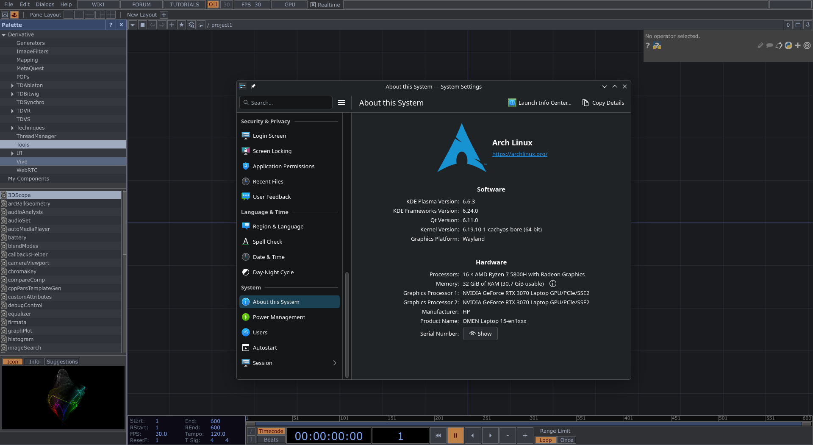

# TouchDesigner-Linux

This is an automated installer to run TouchDesigner on Linux.



Choose your installation method:
- **Automated Installation** : Script one-liner, all-in-one setup
- **Manual Installation** : Step-by-step setup with Bottles

---

<details open>
<summary><b>⚡ Automated Installation (Recommended)</b></summary>


### Prerequisites

> **NVIDIA users:** Please install your GPU driver before running the script. Reboot after.

### Install

```bash
curl -sSL https://raw.githubusercontent.com/isw3d/TouchDesigner-Linux/main/install.sh | bash
```

To run in debug mode (verbose logs for bug reports):

```bash
DEBUG=true bash <(curl -sSL https://raw.githubusercontent.com/isw3d/TouchDesigner-Linux/main/install.sh)
```

The script is idempotent, so it is safe to run it multiple times. It skips already-installed components and can be used for updates or repairs.

**What it does:** detects your distro, installs system packages, downloads a Soda Wine runner, sets up a Wine prefix, installs Windows dependencies via Winetricks, lets you pick a TD version, and creates a launcher with optional desktop integration.

**Supported distros:**

| Family | Examples |
| --- | --- |
| Arch-based | Arch, CachyOS, Manjaro… |
| Debian/Ubuntu-based | Ubuntu, Mint, Pop!_OS… |
| Fedora-based | Fedora, RHEL… |
| openSUSE-based | Leap, Tumbleweed… |

**Expected duration:** 50–60 min on first run.

The longest step is the TouchDesigner `.exe` installation itself. Expect ~30 min for that step alone.

First launch of TouchDesigner can take 1–2 min.

This is normal.

### Useful Paths

| Path | Description |
| --- | --- |
| `~/.local/bin/launch-touchdesigner.sh` | Launcher script |
| `~/.local/share/touchdesigner-linux/` | Wine prefix + assets |
| `~/.local/share/touchdesigner-linux/wine_ui_fixes.tox` | Font fix file |
| `~/.local/share/applications/touchdesigner.desktop` | App menu entry |

### Troubleshooting

**No display / installer GUI fails** : Run from a graphical session with `DISPLAY` or `WAYLAND_DISPLAY` set.

**Version list fetch fails** : The script falls back to a curated list automatically.

**Long dependency phase** : The Windows dependency step is often slow and quiet. Just wait.

**Duplicate menu entry** : Remove stale `.desktop` files in `~/.local/share/applications` and run `update-desktop-database`.

### Uninstall

Run the installer again and choose **Uninstall**. This removes the runner, prefix, launcher, and all desktop entries created by the script.

</details>

---

<details>
<summary><b>Manual Installation (via Bottles)</b></summary>


TouchDesigner is not officially supported on Linux, but it can run very well through Bottles **(Wayland)**.

This guide gives a complete, working setup.

### Table of Contents

- [1. Install Bottles](#1-install-bottles)
- [2. Create the TouchDesigner Bottle](#2-create-the-touchdesigner-bottle)
- [3. Install Dependencies](#3-install-dependencies)
- [4. Install TouchDesigner](#4-install-touchdesigner)
- [5. Launch TouchDesigner](#5-launch-touchdesigner)
- [6. Fix Missing Fonts](#6-fix-missing-fonts)
- [7. Optional: Flatpak Filesystem Access](#7-optional-flatpak-filesystem-access)
- [8. Optional: Desktop Integration](#8-optional-desktop-integration)
- [9. Screenshots](#9-screenshots)

---

### 1. Install Bottles

Install Bottles using one of the methods below.

### Flatpak (recommended on Fedora, Mint, and similar distros)

```bash
flatpak install flathub com.usebottles.bottles
```

If Bottles does not appear in your app menu, restart your session.

### AUR (Arch-based distros, not recommended)

> [!WARNING]
> The Bottles package on AUR is not an official distribution and currently shows many bugs in this setup.
> For stability, use the Flatpak version instead.

```bash
yay -S bottles
```

---

### 2. Create the TouchDesigner Bottle

1. Open Bottles.
2. Create a new bottle.
3. Use these settings:

| Setting | Value |
| --- | --- |
| Name | TouchDesigner |
| Environment | Gaming |
| Runner | soda |
| Directory | Default |

4. Create the bottle and wait for setup to finish.

---

### 3. Install Dependencies

Inside the bottle:

1. Go to **Dependencies**.
2. Install:
	- `allfonts`
	- `d3dx11` (latest version)

---

### 4. Install TouchDesigner

1. Download the Windows installer from Derivative.
2. In Bottles, click **Run Executable**.
3. Select the `.exe` file.
4. Install normally (same process as Windows).

---

### 5. Launch TouchDesigner

1. Open **Programs** in Bottles.
2. Click **Play** on TouchDesigner.

TouchDesigner should now run.

---

### 6. Fix Missing Fonts

Some UI elements may appear blank due to font rendering issues.

### Solution

1. Add `wine_ui_fixes.tox` to your project.
	- [Download `wine_ui_fixes.tox` directly](https://raw.githubusercontent.com/isw3d/TouchDesigner-Linux/main/wine_ui_fixes.tox)
	- Original post: [c0deous on Derivative](https://derivative.ca/community-post/asset/minor-ui-fixes-touchdesigner-wine/73421)
2. Click **Fix Now**.

Fonts will display correctly as long as the `.tox` file is present in the project.

---

### 7. Optional: Flatpak Filesystem Access

If you installed Bottles via Flatpak, opening `.toe` files directly from your system may fail.

Install Flatseal:

```bash
flatpak install flathub com.github.tchx84.Flatseal
```

Then:

1. Open Flatseal.
2. Select **Bottles**.
3. Go to **Filesystem**.
4. Enable **All system files**.

> [!WARNING]
> This disables sandboxing protections for Bottles.

---

### 8. Optional: Desktop Integration

### Desktop shortcut

Inside Bottles, click the **⋮** next to TouchDesigner and select **Add Desktop Entry**.

### File association & icon

1. Associate `.toe` files with TouchDesigner.
2. Assign the TouchDesigner icon (`.png`) to the file type.

The icon is located at:

**Flatpak:**
```
$HOME/.var/app/com.usebottles.bottles/data/bottles/bottles/TouchDesigner/icons/TouchDesigner.png
```

**AUR:**
```
$HOME/.local/share/bottles/bottles/TouchDesigner/icons/TouchDesigner.png
```

### `.toe` icon association example

If the association is correctly configured, `.toe` files will display with the TouchDesigner icon.


If double-clicking a `.toe` file fails to load the project (path error), you need to update your desktop entry.

> [!IMPORTANT]
> Before running scripts or terminal commands, verify what they do first.
> Check them yourself or ask an AI assistant to explain them.
> Avoid running commands you do not understand or trust.

Run the commands below (copy/paste) to create the launcher script:

```bash
mkdir -p ~/.local/bin
cat > ~/.local/bin/touchdesigner-launcher.sh << 'EOF'
#!/bin/bash
# Handle Wine path translation for Bottles
INPUT_PATH="$1"

if [ -z "$INPUT_PATH" ]; then
    # Launch TD empty
    flatpak run --command=bottles-cli com.usebottles.bottles run -p TouchDesigner -b TouchDesigner
else
	# Some desktop environments pass local files as file:// URIs.
	if [[ "$INPUT_PATH" == file://* ]]; then
		INPUT_PATH="${INPUT_PATH#file://}"
		INPUT_PATH="${INPUT_PATH//%20/ }"
	fi

    # Launch TD with the file mapped to the Z: drive
	flatpak run --command=bottles-cli com.usebottles.bottles run -p TouchDesigner -b TouchDesigner --args "z:$INPUT_PATH"
fi
EOF
chmod +x ~/.local/bin/touchdesigner-launcher.sh
```

Then run this command to automatically update the TouchDesigner `.desktop` entry:

```bash
DESKTOP_DIR="$HOME/.local/share/applications"
DESKTOP_FILE="$DESKTOP_DIR/TouchDesigner.desktop"
[ -f "$DESKTOP_FILE" ] || DESKTOP_FILE="$(grep -lE '(^Name=.*TouchDesigner|bottles-cli.*TouchDesigner)' "$DESKTOP_DIR"/*.desktop 2>/dev/null | head -n1)"
[ -n "$DESKTOP_FILE" ] && sed -i "s|^Exec=.*|Exec=$HOME/.local/bin/touchdesigner-launcher.sh %f|" "$DESKTOP_FILE" && echo "Updated: $DESKTOP_FILE" || echo "TouchDesigner desktop file not found in $DESKTOP_DIR"
update-desktop-database "$HOME/.local/share/applications" 2>/dev/null || true
```

---

### 9. Screenshots

### 1. Bottle setup


### 2. Dependencies


### 3. Launch TouchDesigner


### 4. Font missing


### 5. Font fix


</details>

---

## Compatibility Status

| Area | Status | Notes |
| --- | --- | --- |
| Launch and runtime | ✅ Working | App launches normally and runs reliably |
| UI rendering | ✅ Working | Correct with `wine_ui_fixes.tox` |
| Real-time visuals | ✅ Working | Live updates and interaction are smooth |
| Inputs / outputs | ✅ Working | External outputs and inputs are functional in tested scenarios |
| NDI | ✅ Working | Confirmed working |
| TD - Bitwig | ✅ Working | Confirmed working |
| Video Device In | ⚠️ Partial | USB Webcams work on first init, but Wine "locks" the device. Replug or TD restart required to reset |
| NVIDIA TOP | ❌ Not working | Background, Flow and Denoise fail to init CUDA/TensorRT in this environment |
| External installs / integrations | ❓ Not fully tested | Third-party installs, Kinect, extra plugins, and advanced external production pipelines still need broader testing |

---

## Notes

- NVIDIA GPUs are highly recommended.
- Wayland is strongly recommended (X11 may cause launch issues or black screen)
- Performance may vary depending on hardware and driver setup.
- Overall, my experience was smoother than on Windows, with better performance and a much cooler-running machine (gaming laptop) due to Linux optimizations.

---

<div align="center">

Built with care — **Iswad**

</div>